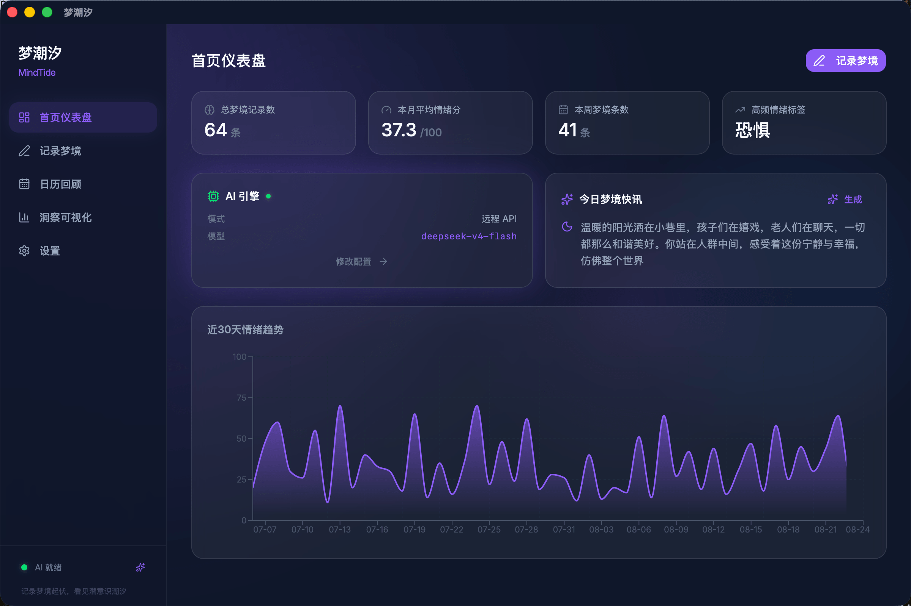
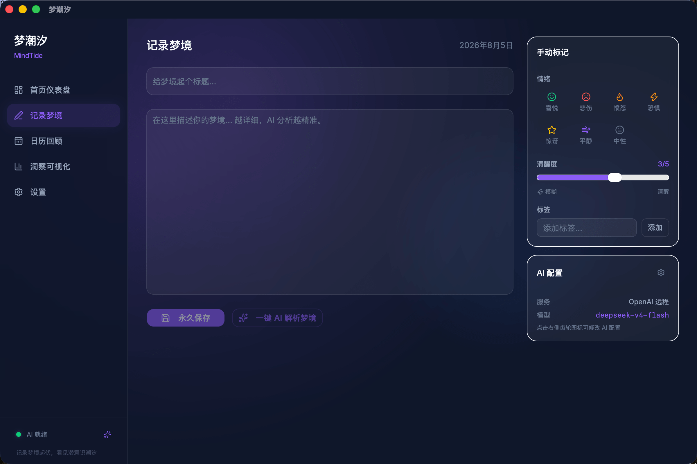
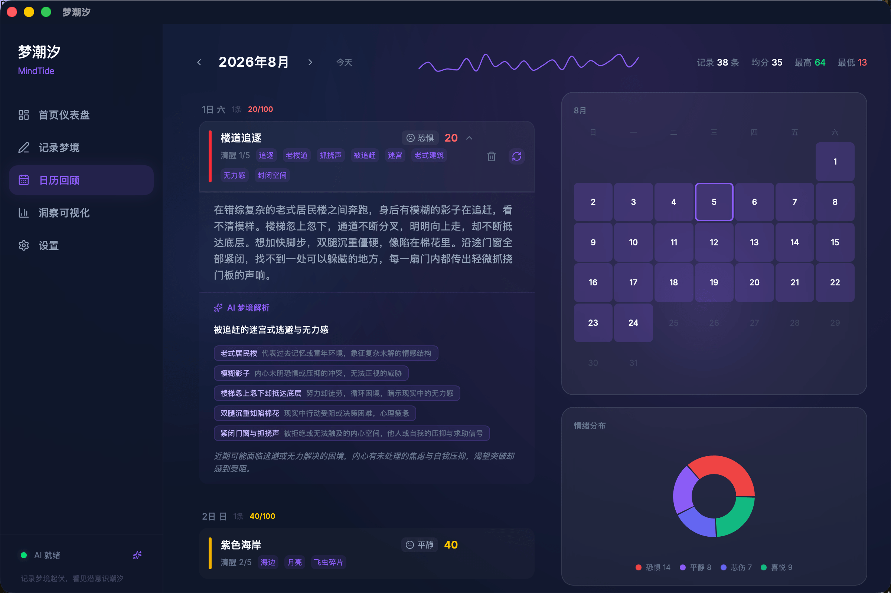
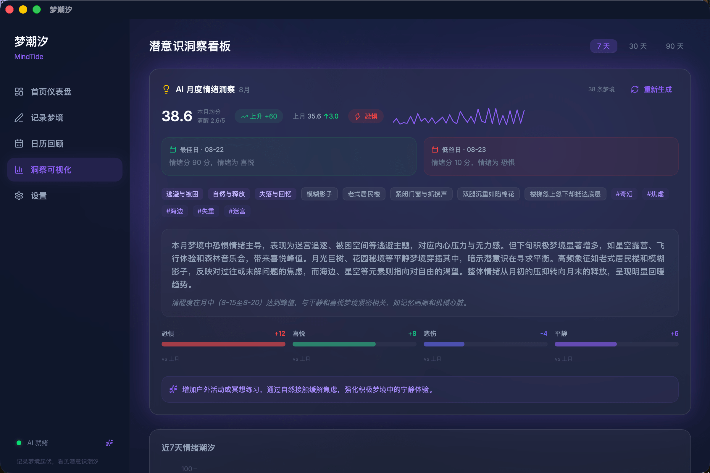
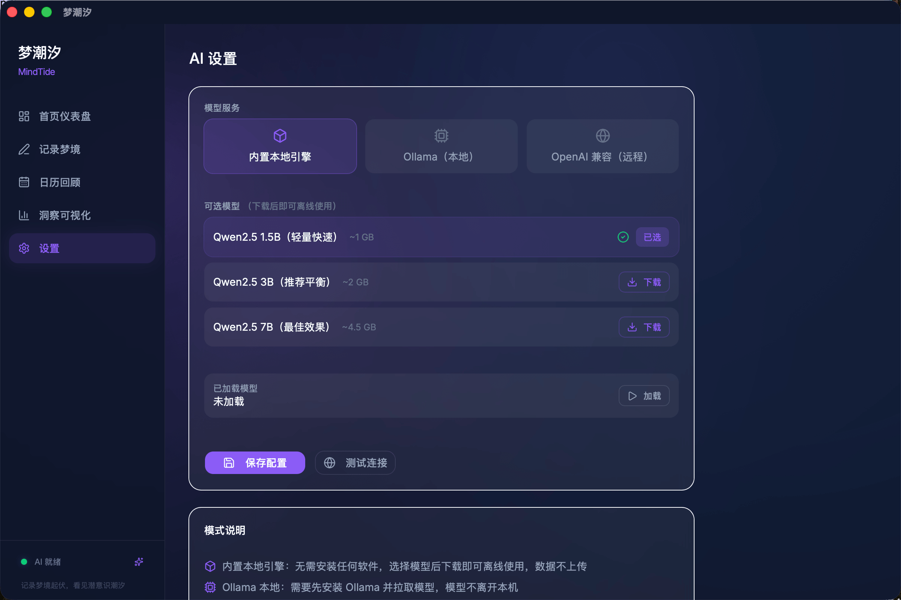

<h1 align="center">
  <br>
  
  <br>
  梦潮汐 · MindTide
  <br>
</h1>

<h4 align="center">记录梦境起伏，看见潜意识潮汐</h4>

<p align="center">
  
  
  
  
  
  
</p>

<p align="center">
  <a href="#-功能特性">功能特性</a> ·
  <a href="#-技术架构">技术架构</a> ·
  <a href="#-快速开始">快速开始</a> ·
  <a href="#-项目结构">项目结构</a> ·
  <a href="#-ai-引擎">AI 引擎</a> ·
  <a href="#-数据库">数据库</a>
</p>

---

## ✨ 功能特性

<table>
<tr>
<td width="50%">

### 📝 梦境记录
- 富文本梦境编辑，支持标题、内容、情绪标签
- 清醒度评分（0-5 级滑动）
- 自定义标签系统
- 自动记录日期与时间

### 🤖 AI 智能分析
- 一键 AI 解析梦境象征与潜意识
- 自动提取情绪维度评分（恐惧/喜悦/悲伤/平静）
- AI 生成梦境标签（与用户标签合并去重）
- 月度深度洞察报告

</td>
<td width="50%">

### 📊 数据可视化
- 情绪趋势面积图
- 情绪维度径向柱状图
- 梦境热度热力图（GitHub 贡献风格）
- 情绪分布环形饼图
- 双色气泡词云

### ⚙️ 多模态 AI
- 内置本地模型（CPU 推理，无需网络）
- Ollama 本地服务对接
- OpenAI / DeepSeek 等兼容 API
- 模型下载进度实时展示

</td>
</tr>
</table>

---

## 🖼️ 界面预览

<div align="center">

| 首页仪表盘 | 梦境记录 |
|:---:|:---:|
|  |  |

| 日历回顾 | 可视化洞察 |
|:---:|:---:|
|  |  |

| 设置中心 |
|:---:|
|  |

</div>

---

## 🏗️ 技术架构

```
React 19 + Vite 8 + TailwindCSS 4  ──IPC──▶  Tauri 2.0 (Rust)  ──SQLite──▶  mind_tide.db
  │                                                │
  ├─ TanStack Query v5（无 Redux）                  ├─ commands/dreams.rs   (CRUD + AI 分析)
  ├─ React Router v7 (BrowserRouter)               ├─ commands/stats.rs    (6 个聚合查询)
  ├─ Recharts + Framer Motion                      ├─ commands/settings.rs (AI 配置 + 模型下载)
  └─ shadcn/ui (base-nova, lucide icons)           ├─ ai/mod.rs            (4 层 JSON 回退解析)
                                                   ├─ ai/local_model.rs   (llama-cpp-2 CPU-only)
                                                   └─ ai/prompts.rs       (3 个结构化 Prompt)
```

| 层级 | 技术 | 说明 |
|------|------|------|
| **桌面壳** | Tauri 2.0 | 跨平台桌面应用，Rust 后端，WebView 前端 |
| **前端** | React 19 + Vite 8 | TypeScript 严格模式，模块化组件架构 |
| **样式** | TailwindCSS 4 + shadcn/ui | CSS-first，全局深色主题 `#0f172a` |
| **路由** | React Router v7 | 5 页面 SPA 路由 |
| **状态** | TanStack Query v5 | 服务端状态管理，1 分钟 staleTime |
| **图表** | Recharts v3 | 声明式 React 图表库 |
| **动画** | Framer Motion v12 | 页面过渡与组件动效 |
| **数据库** | SQLite (rusqlite) | WAL 模式，外键约束，Mutex 线程安全 |
| **AI** | llama-cpp-2 / reqwest | 本地 CPU 推理 + HTTP API 双模式 |
| **Lint** | oxlint + tsc --noEmit | Rust 引擎的 TypeScript Linter |

---

## 🚀 快速开始

### 环境要求

- **Node.js** ≥ 18
- **Rust** ≥ 1.77.2
- **macOS** / Windows / Linux

### 前端开发（浏览器）

```bash
npm install
npm run dev          # 访问 http://localhost:5173
```

### 完整桌面应用

```bash
npm install
npm run tauri dev    # Vite + Rust 后端 + 桌面窗口
```

### 构建与检查

```bash
npm run build        # tsc --noEmit + vite build
npm run lint         # oxlint 代码检查
cargo check          # Rust 类型检查（在 src-tauri/ 下）
```

---

## 📁 项目结构

```
mind-tide/
├── src/                          # 前端源码
│   ├── main.tsx                  # 入口（React 19 + QueryClient）
│   ├── App.tsx                   # 路由配置（5 页面）
│   ├── index.css                 # TailwindCSS 4 主题
│   ├── types/
│   │   └── index.ts              # 共享类型定义
│   ├── constants/
│   │   └── moods.ts              # 情绪常量
│   ├── lib/
│   │   ├── tauri.ts              # Tauri IPC 封装（动态懒加载）
│   │   └── utils.ts              # cn() 工具函数
│   ├── pages/
│   │   ├── Dashboard.tsx         # 首页仪表盘
│   │   ├── EditorPage.tsx        # 梦境编辑器
│   │   ├── CalendarPage.tsx      # 日历回顾
│   │   ├── InsightsPage.tsx      # 洞察看板
│   │   └── SettingsPage.tsx      # 设置中心
│   └── components/
│       ├── layout/               # 布局组件（侧边栏 + 过渡动画）
│       ├── charts/               # 9 个图表组件
│       └── ui/                   # 7 个 UI 基础组件
├── src-tauri/                    # Rust 后端
│   ├── Cargo.toml
│   ├── tauri.conf.json
│   └── src/
│       ├── main.rs               # 入口
│       ├── lib.rs                # 命令注册
│       ├── db.rs                 # 数据库初始化
│       ├── commands/
│       │   ├── dreams.rs         # 15 个梦境 CRUD 命令
│       │   ├── stats.rs          # 6 个统计聚合命令
│       │   └── settings.rs       # AI 配置 + 模型管理
│       └── ai/
│           ├── mod.rs            # AI 调用 + 4 层 JSON 解析
│           ├── local_model.rs    # 本地 LLM 生命周期
│           └── prompts.rs        # 结构化 Prompt 模板
└── docs/
    └── screenshots/              # 界面截图
```

---

## 🤖 AI 引擎

### 三种运行模式

| 模式 | 引擎 | 网络 | 硬件 | 适用模型 |
|------|------|------|------|----------|
| **内置本地** | llama-cpp-2 | ❌ 离线 | CPU-only | Qwen2.5 1.5B/3B/7B GGUF |
| **Ollama** | HTTP API | ✅ 本地 | GPU 可选 | 任意 Ollama 模型 |
| **OpenAI 兼容** | HTTP API | ✅ 远程 | 云端 | GPT-4o / DeepSeek / 兼容 API |

### 四层 JSON 解析（永不报错）

AI 输出格式不稳定是常态。梦潮汐采用 4 层回退解析策略：

1. **直接解析** — `serde_json::from_str`
2. **代码块提取** — 识别 ` ```json ... ``` `
3. **括号平衡** — 深度计数器提取最外层 JSON
4. **正则兜底** — 逐字段正则提取 + 默认值

### 本地模型下载

内置模型从 HuggingFace 自动下载到 `{app_data_dir}/models/`，支持断点续传和损坏文件自动清理。

> 国内下载可能需要代理：`export https_proxy=http://127.0.0.1:7897`

---

## 🗄️ 数据库

5 张核心表，全部通过 `IF NOT EXISTS` 自动创建：

| 表 | 用途 | 关键字段 |
|----|------|----------|
| `dreams` | 梦境主表 | id, title, content, user_mood, ai_mood, mood_score, emotions(JSON), tags(JSON), lucidity, dream_date |
| `analyses` | AI 分析结果 | dream_id(FK→CASCADE), model_name, summary, symbols(JSON), insight |
| `settings` | KV 配置 | key(PK), value |
| `ai_summaries` | AI 摘要 | summary_type, ref_date, content(JSON), UNIQUE(type, date) |

所有日期统一为 `YYYY-MM-DD` 字符串格式。

---

## 🧭 路由

| 路径 | 页面 | 功能 |
|------|------|------|
| `/` | Dashboard | 统计卡片 + 今日快讯 + 情绪趋势 |
| `/editor` | EditorPage | 梦境编辑 + 一键 AI 解析 |
| `/calendar` | CalendarPage | 时间线 + 迷你月历 + 情绪饼图 |
| `/insights` | InsightsPage | 月度洞察 + 热度图 + 气泡词云 |
| `/settings` | SettingsPage | 多 AI 配置 + 模型下载 + 导入/导出 |

---

## 🛠️ 开发命令

| 命令 | 说明 |
|------|------|
| `npm run dev` | Vite 开发服务器（仅前端） |
| `npm run tauri dev` | 完整桌面应用 |
| `npm run build` | TypeScript 检查 + Vite 构建 |
| `npm run lint` | oxlint 代码检查 |
| `cargo check` | Rust 类型检查（在 `src-tauri/` 下执行） |

---

## 📄 许可

MIT License
